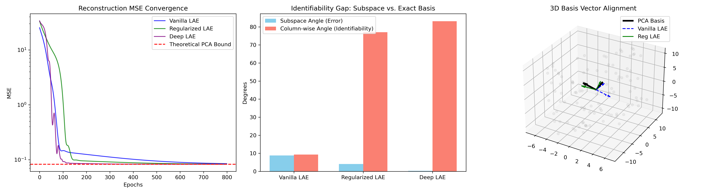

# Dimensionality Reduction: PCA vs. Linear Autoencoders

[]()
[]()
[]()

This repository contains the final course paper and experimental codebase for **CSMATH 2026 (Computer Applied Mathematics)**. 

The project investigates the theoretical equivalence and empirical differences between algebraic **Principal Component Analysis (PCA)** and optimization-based **Linear Autoencoders (LAE)** from both geometric and loss-landscape perspectives.

## 📄 Course Paper
**Title:** *The Geometric and Optimization Perspectives of Dimensionality Reduction: Theoretical Equivalence and Empirical Validation of PCA and Linear Autoencoders*  
**Author:** Xingyu Wu (Zhejiang University)

Read the full paper here: [`course_paper.pdf`](./course_paper.pdf)

### Abstract / TL;DR
While PCA finds orthogonal bases via SVD (constrained exact solution), Linear Autoencoders learn compressed representations via Neural Networks and SGD (unconstrained non-convex optimization). This project proves and empirically validates that:
1. **Vanilla LAEs** recover the exact *Principal Subspace* but suffer from a $GL(K)$ gauge symmetry, failing to identify ordered, orthogonal basis vectors.
2. **Deep Linear Networks** do not introduce spurious local minima, smoothly converging to the PCA global lower bound.
3. **Regularized LAEs** (with non-uniform $L_2$ penalty) successfully break the rotational symmetry, recovering the exact axis-aligned principal components via gradient descent.

---

## 🛠️ Repository Structure

* `course_paper.pdf`: The complete LaTeX-typeset research report, including mathematical proofs and complexity analysis.
* `code_exp.py`: The reproducible PyTorch implementation of the experiments described in the paper.
* `extended_experiment.png`: The visualization output generated by the Python script.

---

## 🚀 How to Run the Experiments

The experiment script evaluates three neural architectures (Vanilla LAE, Regularized LAE, and Deep LAE) against classical PCA and calculates the Subspace Angles and Column-wise Identifiability Gaps.

### 1. Dependencies
Make sure you have Python 3 installed. Install the required libraries using:
```bash
pip install numpy torch matplotlib scipy
```

### 2. Execution
Run the experiment script directly:
```bash
python code_exp.py
```

### 3. Expected Output
Upon successful execution, the script will output the convergence losses and save a high-resolution visualization named `extended_experiment.png` in the same directory.


> *Note: The figure above shows (1) Loss convergence to the PCA theoretical bound, (2) The Identifiability Gap (Subspace vs. Exact Basis), and (3) A 3D quiver plot proving the Regularized LAE (green arrows) exactly aligns with PCA (black arrows), while Vanilla LAE (blue dashed) arbitrarily rotates within the true subspace.*

---

## 📚 Core References
* **Baldi & Hornik (1989)** - *Neural networks and principal component analysis: Learning from examples without local minima.*
* **Kawaguchi (2016)** - *Deep learning without poor local minima.* (NeurIPS)
* **Kunin et al. (2019)** - *Loss landscapes of regularized linear autoencoders.* (ICML)

## 🤝 Acknowledgments
Special thanks to the instructors and teaching assistants of **CSMATH 2026** for their inspiring lectures and guidance.
